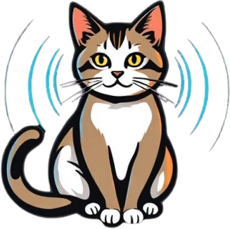

# @ham-js/cat

<div align="center">
  <a href="https://github.com/ham-js/cat">
    
  </a>

<h3 align="center">@ham-js/cat</h3>

  <p align="center">
    A JavaScript library for all things related to computer aided transceivers.
    <br />
    <a href="https://ham-js.github.io/cat"><strong>Explore the docs »</strong></a>
    <br />
    <br />
    <a href="https://ham-js.github.io/cat">View Demo</a>
    &middot;
    <a href="https://github.com/ham-js/cat/issues/new?template=bug_report.md">Report Bug</a>
    &middot;
    <a href="https://github.com/ham-js/cat/issues/new?template=feature_request.md">Request Feature</a>
  </p>
</div>

ADD BADGES

# Examples

## Create a command for the Yaesu FT-891

## Create a generic serial port

## Send a command via WebUSB

## Send a command via Node SerialPort

## Run the end-to-end test suite against your device

# Features

* *create commands* for transceivers, antennas and other devices
* send commands via a *generic serial port interface* that you decide what it actually is (e.g. can be a COM port, a websocket for remote stations or something else)
* send commands via *webserial* (possibly a driver on the host necessary) or our *webusb drivers* (no driver on the host necessary)
* (mostly) *platform-agnostic*

# Architecture

There are some things we want to support:

* *generic interfaces to cat accessories* - e.g. your software doesn't need to know about which transceiver it actually interfaces for some common operations
* *specific interfaces to cat accessories* - e.g. if your transceiver supports specific parameters for common commands, you can still use them
* *type-safety at build-time* - `@ham-js/cat` is written in typescript which makes it easier to catch some types of bugs at build time
* *introspection* - you can query the exact shape of e.g. command parameters at runtime to support building dynamic interfaces for specific transceivers. Or you can query all devices by name and type that we support
* *type-safety at runtime* - we validate inputs according to schemas so that we can catch erroneous input at runtime

We do this by splitting communication up in the following way:

<svg xmlns="http://www.w3.org/2000/svg" xmlns:xlink="http://www.w3.org/1999/xlink" width="163pt" height="188pt" viewBox="0.00 0.00 162.78 188.00">
<g id="graph0" class="graph" transform="scale(1 1) rotate(0) translate(4 184)">
<title>G</title>
<polygon fill="none" stroke="none" points="-4,4 -4,-184 158.78,-184 158.78,4 -4,4"/>
<!-- GSD -->
<g id="node1" class="node">
<title>GSD</title>
<polygon fill="none" stroke="white" points="144.08,-108 10.69,-108 10.69,-72 144.08,-72 144.08,-108"/>
<text fill="white" text-anchor="middle" x="77.39" y="-85.8" font-size="14.00">generic serial drivers</text>
</g>
<!-- CF -->
<g id="node2" class="node">
<title>CF</title>
<polygon fill="none" stroke="white" points="138.84,-36 15.94,-36 15.94,0 138.84,0 138.84,-36"/>
<text fill="white" text-anchor="middle" x="77.39" y="-13.8" font-size="14.00">command factories</text>
</g>
<!-- GSD&#45;&#45;CF -->
<g id="edge1" class="edge">
<title>GSD--CF</title>
<path fill="none" stroke="white" d="M77.39,-71.7C77.39,-60.85 77.39,-46.92 77.39,-36.1"/>
</g>
<!-- PSSD -->
<g id="node3" class="node">
<title>PSSD</title>
<polygon fill="none" stroke="white" points="154.78,-180 0,-180 0,-144 154.78,-144 154.78,-180"/>
<text fill="white" text-anchor="middle" x="77.39" y="-157.8" font-size="14.00">platform-specific drivers</text>
</g>
<!-- PSSD&#45;&#45;GSD -->
<g id="edge2" class="edge">
<title>PSSD--GSD</title>
<path fill="none" stroke="white" d="M77.39,-143.7C77.39,-132.85 77.39,-118.92 77.39,-108.1"/>
</g>
</g>
</svg>

# E2E Tests

We provide an automated end-to-end test suite that can run real commands against physical devices via node-specific drivers.

```bash
yarn run test:e2e
```

# Contributing

Adding commands, adding a serial driver for your device, adding a platform-specific driver

# Contributors
